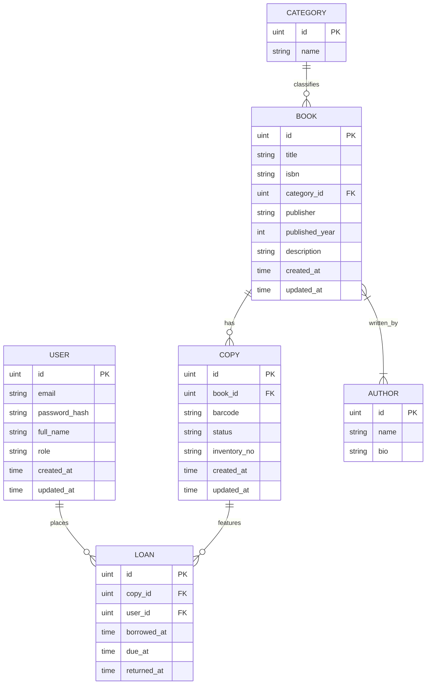

# Entity Relationship Diagram

This diagram represents the database schema for the LibraTrack system.

```mermaid
erDiagram
    USER {
        uint id PK
        string email
        string password_hash
        string full_name
        string role
        time created_at
        time updated_at
    }

    BOOK {
        uint id PK
        string title
        string isbn
        uint category_id FK
        string publisher
        int published_year
        string description
        time created_at
        time updated_at
    }

    COPY {
        uint id PK
        uint book_id FK
        string barcode
        string status
        string inventory_no
        time created_at
        time updated_at
    }

    LOAN {
        uint id PK
        uint copy_id FK
        uint user_id FK
        time borrowed_at
        time due_at
        time returned_at
    }

    CATEGORY {
        uint id PK
        string name
    }

    AUTHOR {
        uint id PK
        string name
        string bio
    }

    USER ||--o{ LOAN : places
    BOOK ||--o{ COPY : has
    COPY ||--o{ LOAN : features
    CATEGORY ||--o{ BOOK : classifies
    BOOK }|--|{ AUTHOR : written_by
```
